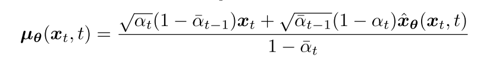

## 关于DDPMSampler中的step函数的计算

[Understanding Diffusion Models: A Unified Perspective](https://arxiv.org/abs/2208.11970)

xθ(xt, t) is parameterized by a neural network that seeks to predict x0 from noisy image xt and time index t.
